# 基于SpringBoot的音乐试听小程序

#### 介绍
```
本系统后台系统主要使用Java语言
后台整体架构采用：SpringBoot + MyBatisPlus + MySQL数据库
前台整体架构才用：uniapp + Vue
```


项目设计为B/S架构 + 小程序客户端，

后台功能包括了：用户管理、轮播图管理、歌手管理、歌曲管理、文件上传、留言管理、管理员账号管理

小程序功能包括了：搜索歌曲、歌曲试听、歌手列表、歌曲列表、轮播图展示、收藏歌曲、历史播放、我的收藏、用户留言


#### 系统技术栈

后台：SpringBoot + MyBatisPlus + Thymeleaf+ Layui + PearAdmin + jQuery + JavaScript +  MySQL 

小程序端：uniapp + Vue


**非免费开源**

**需要加Q：943701114，可供学生毕设参考使用，再次强调，非免费开源，非诚勿扰**


#### 项目截图

##### 管理员端截图

| 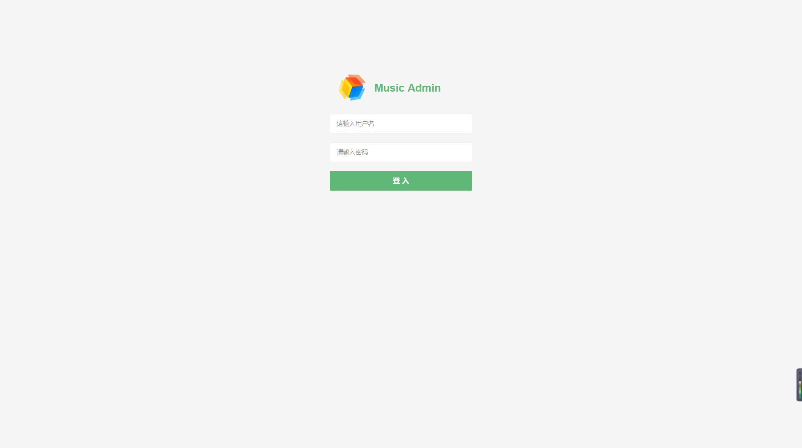 | 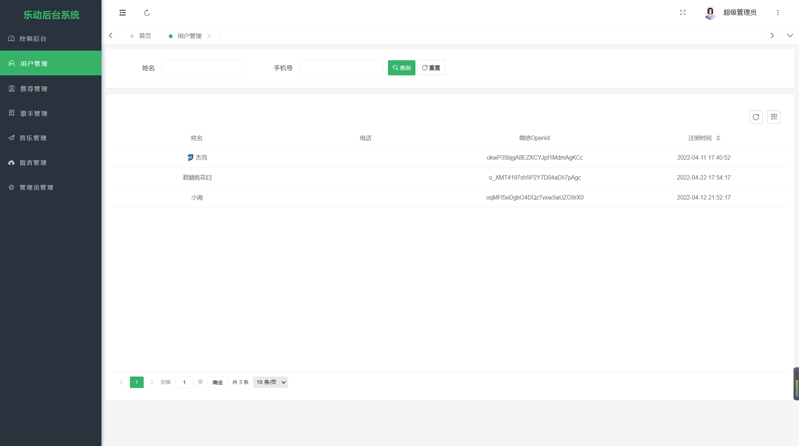 |
| ----------------------------------------------- | ----------------------------------------------- |
| 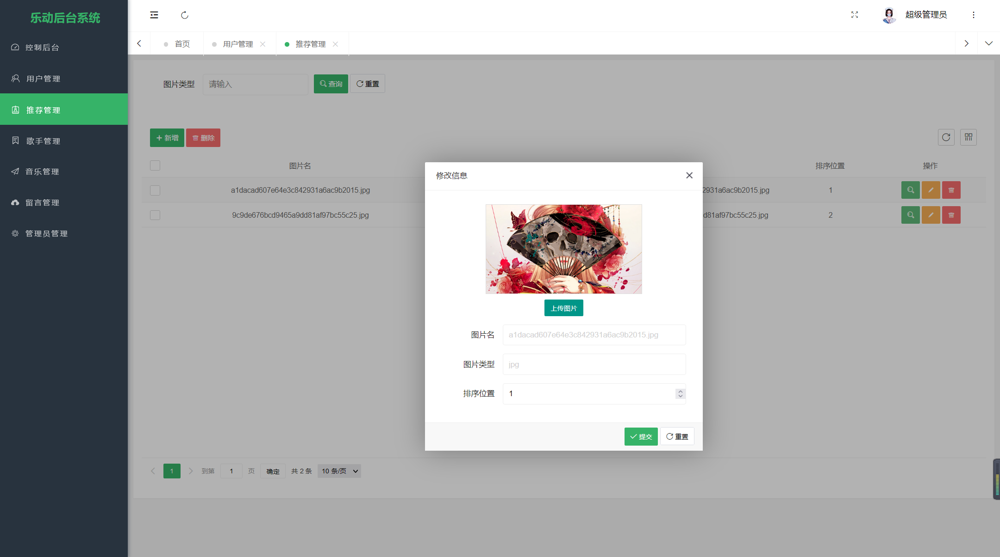 | 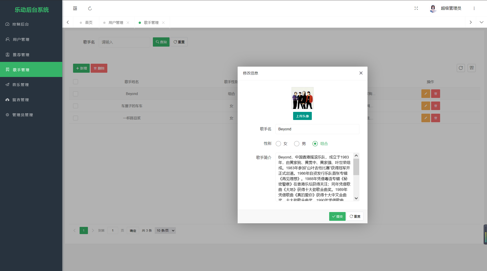 |
| 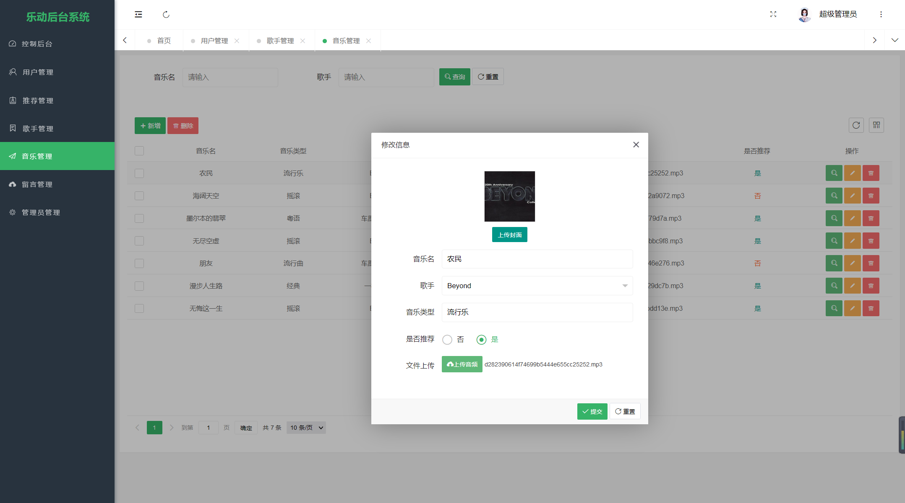 | 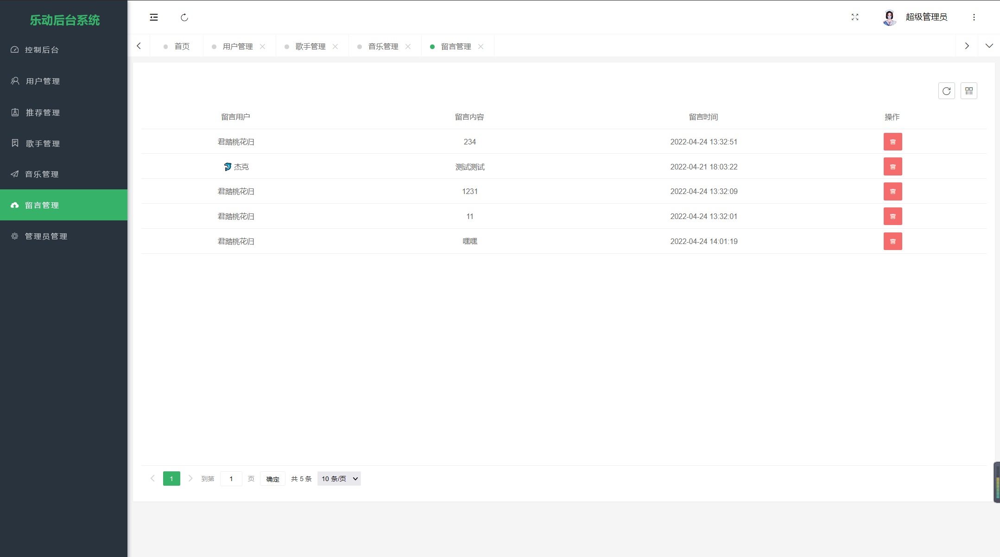 |


##### 小程序端截图

| 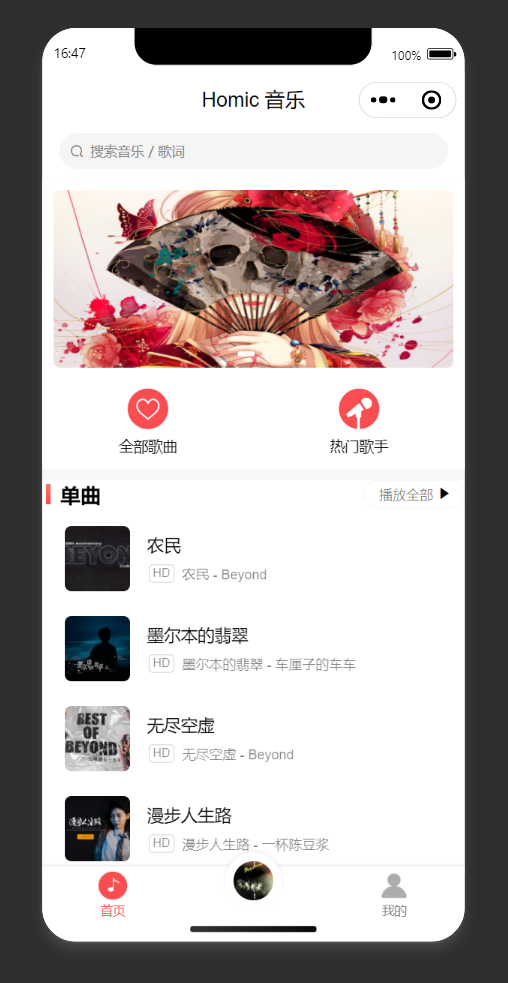 |  |
| --------------------------------------------- | --------------------------------------------- |
| 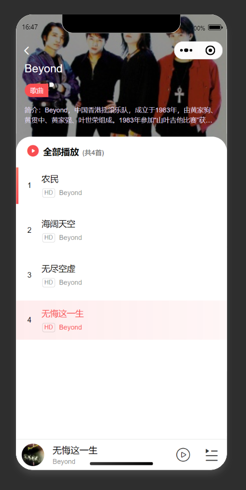 | 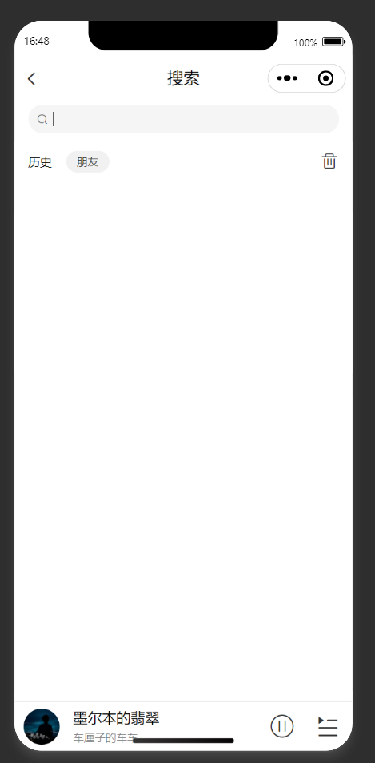 |
| 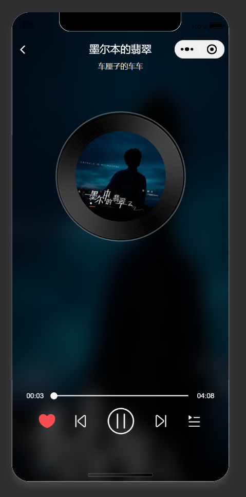 | 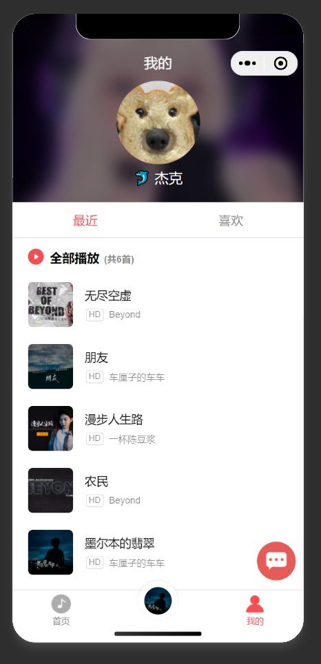 |


#### 参与贡献

1.  斗佛